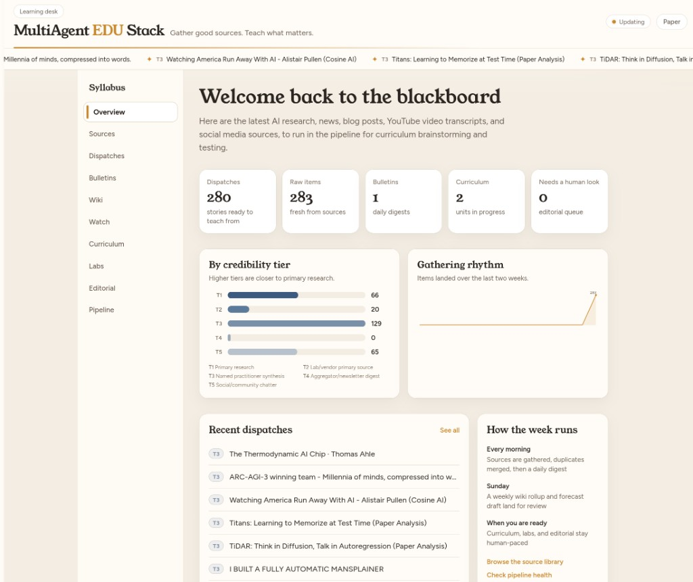

# MultiAgentEDUstack

A working implementation of the multi-agent curriculum pipeline described in
[Curriculum at Model Speed](https://kaizencode.art/notepad/ai-curriculum-multi-agent-system/),
a system that sources AI knowledge fast enough to matter, curates it against
a five-tier credibility rubric, and scaffolds it into curriculum, without a
six-month lag.

[](https://kaizencode.art/notepad/ai-curriculum-multi-agent-system/)

*[Curriculum at Model Speed](https://kaizencode.art/notepad/ai-curriculum-multi-agent-system/) — design essay and source table.* The screenshot is the live desk that implements it.

This is a real, running system, not a design doc. Everything below is either
verified working against live data, or explicitly marked as a stub with the
reason it isn't.

## Architecture

```
Five scouts (scheduled nightly, no LLM call)
  arxiv_scout · hn_scout · github_trending_scout · blog_scout · youtube_scout
  (+ reddit_scout, social_scout: real adapters, credential-gated, see below)
        │
        ▼
raw_items (SQLite)
        │
        │  pipeline/dedupe.py -- rule-based tier scoring + story merging
        ▼
curated_items
        │
        │  .claude/skills/synthesis-digest -- daily, via headless Claude Code
        ▼
digests/*.md  +  topics assigned back onto curated_items
        │
        │  .claude/skills/weekly-wiki -- Sundays, rolls daily digests
        ▼
wiki/week-*.md
        │
        │  .claude/skills/trend-forecast -- Sundays, reads assigned topics
        ▼
forecast_watchlist
        │
        │  .claude/skills/curriculum-scaffold -- run by hand, per topic
        ▼
curriculum_units  (objective + summary, quizzes, exercises, project; durable-vs-frontier call)
        │
        │  .claude/skills/lab-generation -- run by hand, per unit
        ▼
lab_specs  (spec only, does not provision live infrastructure, see below)
        │
        │  .claude/skills/editorial-review -- human-gated, never auto-approves
        ▼
editorial_reviews  →  shipped curriculum
```

`.claude/skills/decay-deprecation` runs independently, flagging shipped units
that have gone stale.

## What's actually running right now

Three systemd user timers (plus a deprecated synthesis alias):

- `multiagentedustack-ingest.timer`: **02:15 daily.** Runs all seven scouts
  and the dedup pass. Deterministic, no LLM call, no cost. Offset from the
  author's existing `open-brain-compile.timer` (02:30) to avoid contention.
- `multiagentedustack-digest.timer`: **03:00 daily.** Runs `synthesis-digest`
  headlessly via `claude -p` for new-article summaries.
- `multiagentedustack-weekly.timer`: **Sunday 03:30.** Runs `weekly-wiki`
  then `trend-forecast` headlessly via `claude -p`.

If you still have the old Sunday-only unit enabled, migrate:

```bash
systemctl --user disable --now multiagentedustack-synthesis.timer
systemctl --user enable --now multiagentedustack-digest.timer
systemctl --user enable --now multiagentedustack-weekly.timer
```

Check them: `systemctl --user list-timers 'multiagentedustack-*'`
Logs: `logs/ingest-*.log`, `logs/digest-*.log`, `logs/weekly-*.log`.

`curriculum-scaffold`, `lab-generation`, and `editorial-review` are **not**
on a timer, they're judgment calls worth being in the loop for. Run them
by hand:

```bash
claude -p "/curriculum-scaffold" --allowedTools "Bash Read Write Edit"
```

## The database

SQL is the source of truth; digests, curriculum, and lab specs are
regenerable views over it, the same discipline as the author's OB1/Open
Brain setup ("the wiki is a build artifact"). Schema: `db/schema.sql`.
The live database (`db/maes.sqlite3`) and generated output
(`digests/`, `wiki/`, `curriculum/`, `labs/`, `transcripts/`) are gitignored:
runtime state, not source.

Everything an agent skill reads or writes goes through `scripts/db.py`
(`python3 scripts/db.py --help` for the full command list) rather than
freehand SQL scattered across prompts.

## Source database

`data/sources.yaml` is the credibility-tiered source list (55 sources, 9
categories) from the companion blog post's interactive source explorer.
Scouts read their target lists from it (YouTube channels, blog feeds);
arXiv categories and HN/GitHub keyword filters are set directly in their
scripts.

## What's real vs. stubbed, and why

| Piece | Status | Why |
|---|---|---|
| arXiv, HN, GitHub trending, blog/newsletter RSS scouts | **Real, verified live** | Public APIs/feeds, no credentials needed |
| YouTube scout | **Real, verified live** | `yt-dlp` for channel listing + auto-caption extraction, no YouTube Data API key needed |
| Reddit scout | **Real adapter, credential-gated** | Reddit's unauthenticated `.json` endpoints 403 from this network (verified directly, not assumed) since their 2023 API lock-down. Needs a free OAuth app (`REDDIT_CLIENT_ID`/`SECRET` in `.env`) |
| Bluesky scout | **Real adapter, unverified from this network** | Free (handle + app password, no paid tier), but this sandbox's network got blocked by Bluesky's edge while building this. Should work from a normal residential/office network |
| X/Twitter scout | **Real adapter, inert without a paid API tier** | X's v2 API requires paid access for meaningful read scope as of 2026; this repo doesn't assume you're paying for it |
| Credibility + Dedup | **Real, rule-based** | Tier lookup by scout/category, exact-URL then title-similarity merge. No LLM call |
| Synthesis-Digest (daily), Weekly-Wiki + Trend-Forecast (Sunday) | **Real, LLM-driven, scheduled** | Verified end to end via headless `claude -p` against live data |
| Curriculum-Scaffold, Lab-Generation | **Real, LLM-driven, manual** | Judgment calls, run by hand rather than unattended |
| Editorial-Review | **Real, human-gated** | Produces the two-axis report and explicitly refuses to auto-approve anything; a decision is only recorded after a human states one |
| Lab provisioning (live cloud sandboxes) | **Not built** | `lab-generation` produces a spec only. This repo has no cloud credentials wired in, and standing up billed infrastructure isn't something an unattended agent should do on its own judgment. Turning a spec into a real environment is a separate, explicitly-authorized step you take by hand |
| Behavior-change telemetry | **Scoped down** | The blog post's design targets a ~10,000-engineer org with toolchain-wide instrumentation. At solo-practitioner scale, `telemetry_events` tracks whether a surfaced item actually gets used (opened, cited in a post, promoted to curriculum), a real but much smaller version of the same idea |

## Setup

```bash
pip install -r requirements.txt
cp .env.example .env   # fill in whatever credentials you actually have
python3 scripts/ingest.sh   # or: bash scripts/ingest.sh
python3 scripts/db.py new-items
```

See `.env.example` for exactly which credentials unlock which scouts.
